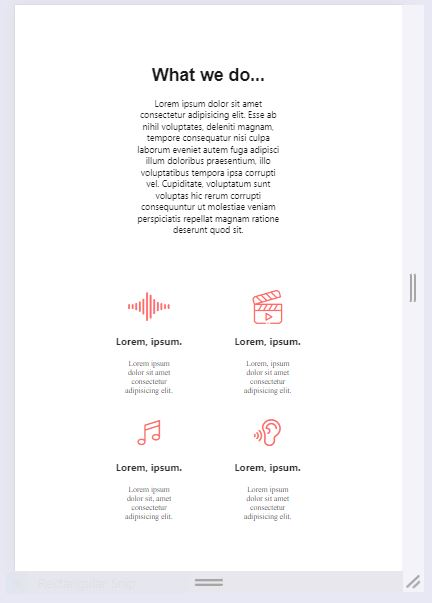
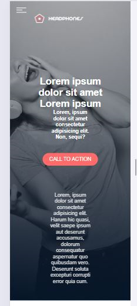

# Headphone Company Responsive Webpage
## Description
This project is a responsive webpage for a headphone company, designed to work seamlessly on mobile phones, tablets, and desktops. The webpage is built using only HTML and CSS and follows the layout provided in a Figma design file.
## Screenshots



## Installation and Setup

1. Clone the repository:
    ```bash
    git clone https://github.com/yourusername/headphone-company-webpage.git
    ```

2. Navigate to the project directory:
    ```bash
    cd headphone-company-webpage
    ```

3. Open the `index.html` file in a web browser to view the webpage.
## Usage
- Open `index.html` in any web browser.
- Resize the browser window to see how the webpage adjusts for different screen sizes (desktop, tablet, mobile).
## Features
- Fully responsive design for phones, tablets, and desktops.
- Clean and modern layout based on Figma design.
- Built using only HTML and CSS without JavaScript.
## Built with
- HTML5
- CSS3
## Project Status
This project is currently under development.
## Contact
Aime Ishimwe - [medicalmind07@gmail.com](mailto:medicalmind07@gmail.com)
